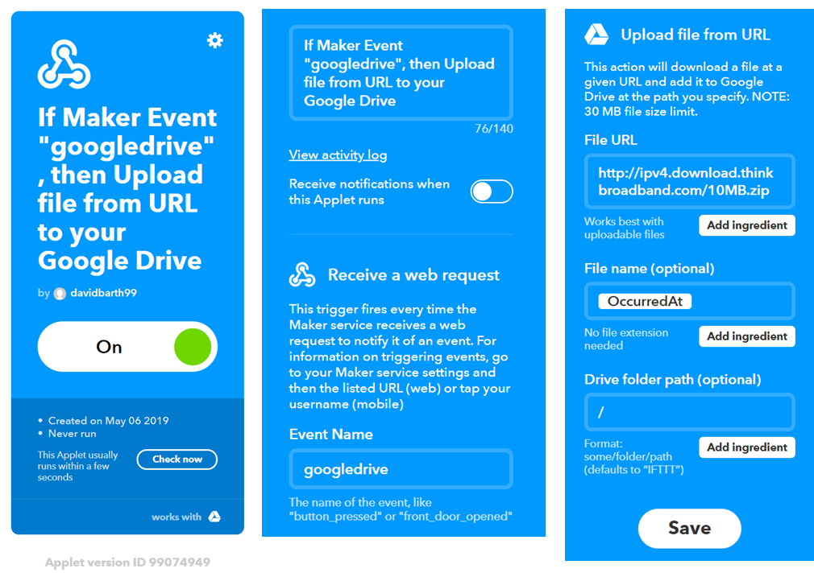

# IFTTT

Die nachfolgende Dokumentation basiert auf einer Projektarbeit, für das Modul 242, an der Technischen Berufsschule Zürich, von Rafael Goncalves und David Barth.

Projektidee
-----------

- - -

Verschiedene Trigger lösen je eine verschiedene Reaktion aus

* E-Mail Bestätigung bei Knopfdruck
* IFTTT Trigger über RFID-Auslöser + Timestamp
* Verschiedene Nachrichten bei Drehen des Encoders
* HTTP-Get an E-Mail weiterleiten + in Datei speichern
* Auf Abruf Content eines Files lesen und in ein anderes File redirecten

Verwendete Tools / Dienste
--------------------------

Node-RED & Raspberry Pi als Broker
* Integrierte Funktionen von Node-RED (Twitter-Post, File-Generator, Mails senden etc.)

IFTTT Webhooks (If This Then That)
* Webhook der File auf Google-Drive speichert

IFTTT
-----

- - -

Umsetzung
---------

Raspberry Pi als MQTT Broker und Gateway zu IFTT aufsetzen:
* [Mosquitto](https://mosquitto.org/) und
* [Node-RED](https://nodered.org/) installieren.
* In Node-RED
    * flow.json importieren und IP-Adresse des MQTT Brokers auf Raspberry Pi anpassen
    * Trigger IFTTT Zugriffsinformationen anpassen
    * für die restlichen Dienste gleich verfahren.
    
IoTKit als MQTT Publisher aufsetzen:
* [MQTTPublish](https://os.mbed.com/teams/IoTKitV3/code/MQTTPublish/) in Online Compiler importierten
* Variable `hostname` und `port` auf Raspberry Pi anpassen.  
    

